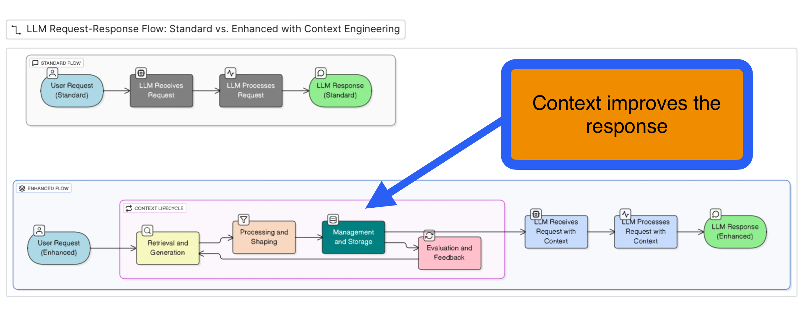

# Context Engineering: Making AI Smarter Through Better Information Management

 **Context Engineering** is the art and science of helping AI systems work with information more effectively. Just like how a well-organized workspace helps you be more productive, context engineering helps large language models (LLMs) process and use information in smarter ways.

## What Is Context Engineering?

Context Engineering is a specialized field focused on optimizing how we feed information to AI systems. Instead of just throwing data at an AI and hoping for the best, context engineering involves carefully structuring, finding, and managing the right information at the right time. It's like being a skilled librarian for AI systems!

## The Two Main Areas of Context Engineering

Context engineering is organized into two complementary areas that work together to create more effective AI systems:

### 🏗️ Foundational Components
*The Essential Building Blocks*

These are the core techniques and methods that form the foundation of effective context management:

**Context Retrieval and Generation**
- Finding and creating the most relevant information for specific tasks
- Think of this as the AI's research assistant, gathering exactly what's needed

**Context Processing** 
- Organizing and refining information so it's easy for the AI to understand
- Like editing and formatting a document to make it crystal clear

**Context Management**
- Keeping track of information flow and ensuring everything stays organized
- Similar to project management, but for information and context

### ⚙️ System Implementations
*Putting the Pieces Together*

These are the practical applications where foundational components come to life:

**Retrieval-Augmented Generation (RAG)**
- AI systems that can pull in external information to enhance their responses
- Imagine an AI that can quickly reference a vast library while answering your questions

**Memory Systems**
- Giving AI the ability to remember and build upon previous conversations
- Like helping AI develop a continuous memory across interactions

**Tool-Integrated Reasoning (TIR)**
- AI systems that can use various tools and resources to solve problems
- Think of an AI assistant that can use calculators, search engines, and other tools seamlessly

**Multi-Agent Systems**
- Multiple AI agents working together, each with specialized roles
- Like a team of experts collaborating on complex projects

## Why Context Engineering Matters

Context engineering directly supports two crucial values:

- **Productivity**: By making AI systems more efficient and accurate, we help people accomplish more in less time
- **Enterprise Value**: Well-engineered context systems create reliable, scalable solutions that businesses can depend on

Whether you're building AI applications, working with existing AI tools, or simply curious about how AI systems can be improved, context engineering offers a structured approach to making artificial intelligence more helpful, accurate, and efficient for everyone.
